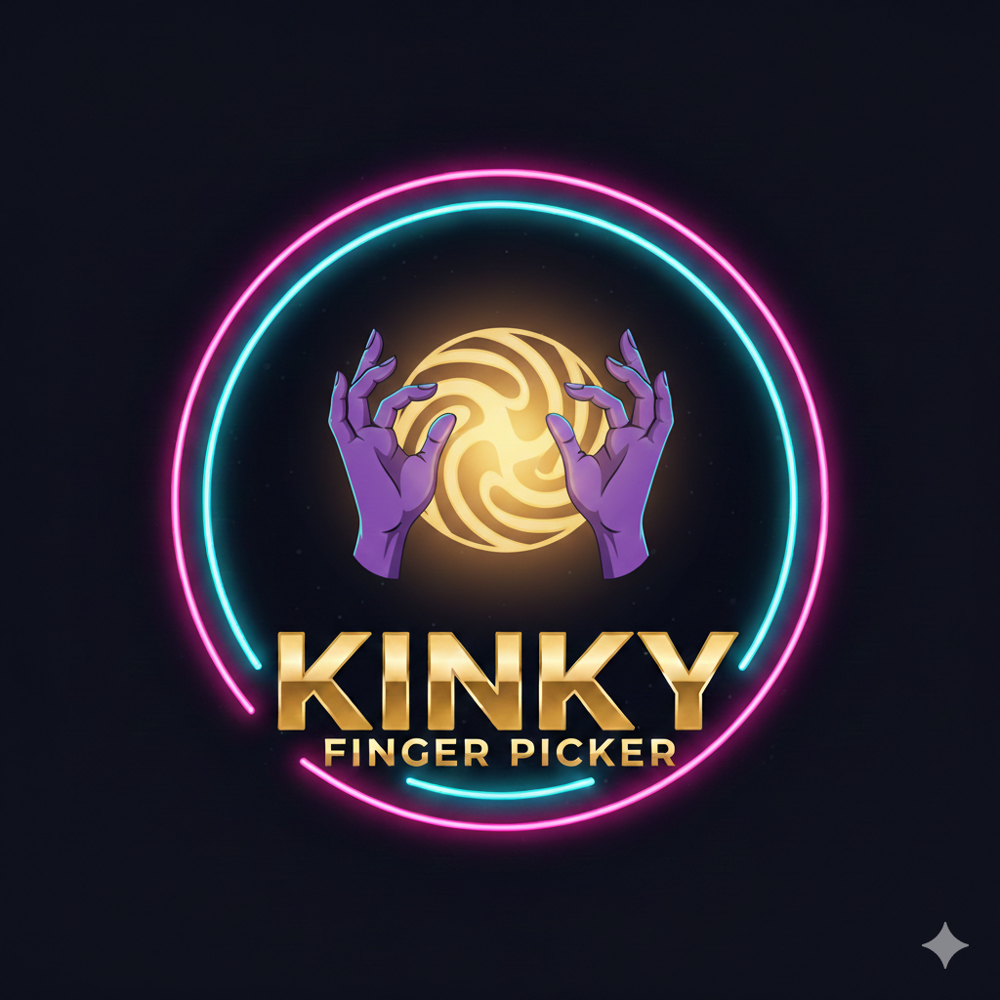

<div align="center">

  <!-- Logo -->
  

  <!-- Title -->
  <h1>🌶️ Kinky Finger Picker</h1>

  <!-- Tagline -->
  <p>The ultimate party game for unforgettable nights with friends</p>

  <!-- Badges -->
  [](https://opensource.org/licenses/MIT)
  [](https://reactnative.dev/)
  [](https://expo.dev/)
  [](https://www.typescriptlang.org/)
  [](https://api.z.ai)

  [](https://github.com/andresmoralesc1/kinky-finger-picker/actions/workflows/ci.yml)
  [](https://github.com/andresmoralesc1/kinky-finger-picker/actions)
  [](https://github.com/andresmoralesc1/kinky-finger-picker)

  <!-- Warning Badge -->
  [](https://github.com/andresmoralesc1/kinky-finger-picker)

</div>

---

## ⚠️ Disclaimer

**This app contains adult content and is intended for consenting adults (18+) only.** Please play responsibly and always respect boundaries.

---

## 🎮 About

**Kinky Finger Picker** is a multiplayer party game that combines random finger selection with truth-or-dare style challenges. Perfect for breaking the ice and heating things up at parties!

### ✨ Key Features

| Feature | Description |
|---------|-------------|
| **🤖 AI-Powered** | Generate custom questions with Z.ai GLM-4.6 |
| **🎯 Multi-Touch** | Advanced finger detection for 2-10 players |
| **🎨 3 Game Modes** | Hetero, Gay, and Lesbian layouts |
| **🌶️ 3 Intensity Levels** | Mild, Spicy, and Extreme |
| **📊 Statistics** | Track rounds, rankings, and achievements |
| **🏆 Gamification** | Unlock achievements, earn XP, level up |
| **📱 Social Sharing** | Share epic moments with styled screenshots |
| **⚙️ Customizable** | Create your own questions and settings |

---

## 🚀 Quick Start

```bash
# Clone the repository
git clone https://github.com/andresmoralesc1/kinky-finger-picker.git

# Navigate to project
cd kinky-finger-picker

# Install dependencies
npm install

# Start the development server
npm start
```

**Then scan the QR code with Expo Go on your phone!**

---

## 🎯 How to Play

1. **Place fingers** - All players touch the screen with one finger
2. **Countdown** - 3-second suspenseful countdown
3. **Selection** - Roulette animation randomly picks a player
4. **Challenge** - Selected player gets a question or dare
5. **Complete or Skip** - Do the dare or use a limited skip
6. **Share** - Share funny moments with friends

---

## 🤖 AI Features

### 💬 AI Chat Assistant
- Get personalized suggestions and advice
- Context-aware recommendations based on game state
- Real-time conversational interface

### ✨ AI Question Generator
- Create unlimited custom questions
- Choose intensity, category, and quantity
- Add custom prompts for specific requirements

### 🔥 Powered by Z.ai GLM-4.6
- 128k context window
- Creative, varied responses
- Fallback questions for offline mode

---

## 🎨 Game Modes

| Mode | Layout | Description |
|------|--------|-------------|
| **Hetero** 🔥 | Split screen | Female left, Male right |
| **Gay** 🌈 | Full screen | All players |
| **Lesbian** 💖 | Full screen | All players |

---

## 🌶️ Intensity Levels

| Level | Vibe | Examples |
|-------|------|----------|
| **Mild** 🌶️ | Flirty & playful | Compliments, fun questions |
| **Spicy** 🌶️🌶️ | Getting hot | Kisses, touching, dares |
| **Extreme** 🌶️🌶️🌶️ | No limits! | Full adult content (18+) |

---

## 📸 Screenshots

<!-- TODO: Add screenshots -->
<div align="center">
  
  <p>Screenshots coming soon!</p>
</div>

---

## 🛠️ Tech Stack

```yaml
Core:
  - React Native 0.81.5
  - Expo 54
  - TypeScript 5.9

UI & Animations:
  - expo-linear-gradient
  - react-native-reanimated
  - react-native-gesture-handler
  - react-native-view-shot

Features:
  - expo-av (audio)
  - expo-haptics (vibration)
  - expo-sharing (social sharing)
  - @react-native-async-storage (persistence)

AI:
  - Z.ai GLM-4.6 API
  - Custom AI service layer
```

---

## 📁 Project Structure

```
kinky-finger-picker/
├── src/
│   ├── components/          # 14 reusable components
│   │   ├── ConfettiEffect.tsx
│   │   ├── RouletteAnimation.tsx
│   │   ├── ShareCard.tsx
│   │   └── ...
│   ├── screens/            # 11 game screens
│   │   ├── AIChatScreen.tsx          🆕
│   │   ├── AIQuestionGeneratorScreen.tsx  🆕
│   │   ├── ImprovedGameScreen.tsx
│   │   ├── ModeSelectionScreen.tsx
│   │   └── ...
│   ├── utils/
│   │   ├── zaiService.ts             🆕
│   │   ├── sounds.ts
│   │   ├── storage.ts
│   │   └── achievements.ts
│   ├── data/
│   │   └── questions.ts    # 60+ questions
│   └── types/
│       └── index.ts        # TypeScript definitions
├── assets/
│   └── logo.png            # App logo
├── App.tsx                 # Main app
└── package.json
```

---

## ⚙️ Configuration

### Environment Setup

No configuration required! The app works out of the box.

### AI Configuration (Optional)

The app uses Z.ai's GLM-4.6 model for AI features. The API is pre-configured in `src/utils/zaiService.ts`.

```typescript
const ZAI_CONFIG = {
  baseURL: 'https://api.z.ai/api/coding/paas/v4',
  model: 'glm-4.6',
  maxTokens: 1000,
  temperature: 0.9,
};
```

---

## 🧪 Testing

```bash
# Run tests
npm test

# Run tests in watch mode
npm run test:watch

# Generate coverage report
npm run test:coverage

# Type checking
npm run typecheck
```

**Current Status:** 67/67 tests passing ✅

---

## 📱 Building for Production

### Development Build
```bash
npm run android
npm run ios
```

### Production Build with EAS
```bash
# Install EAS CLI
npm install -g eas-cli

# Build for Android
eas build --platform android --profile production

# Build for iOS
eas build --platform ios --profile production
```

For detailed deployment instructions, see [DEPLOYMENT.md](./DEPLOYMENT.md).

---

## 🎨 Customization

### Add Your Own Questions

```typescript
// src/data/questions.ts
{
  id: 'custom_1',
  text: 'Your question here',
  level: 'mild' | 'spicy' | 'extreme',
  type: 'question' | 'dare',
  category: 'classic' | 'romantic' | 'party' | 'nsfw' | 'custom',
}
```

### Customize Colors

```typescript
// src/utils/colors.ts
export const PLAYER_COLORS = [
  '#FF006E',  // Player 1
  '#8338EC',  // Player 2
  '#3A86FF',  // Player 3
  // ... add more
];
```

---

## 🗺️ Roadmap

### ✅ Completed (v1.0)
- [x] Core gameplay with multi-touch detection
- [x] 3 game modes × 3 intensity levels
- [x] 60+ built-in questions
- [x] Statistics and achievements system
- [x] Custom questions manager
- [x] Visual themes (6 themes)
- [x] Social sharing
- [x] **AI-powered features** 🆕

### 🚧 In Progress
- [ ] Performance optimization
- [ ] Additional accessibility features

### 📋 Planned (v2.0)
- [ ] Player profiles with names
- [ ] Multiplayer over WiFi
- [ ] Video dare recording
- [ ] Image support for questions
- [ ] Export/import question packs

---

## 📊 Stats

| Metric | Value |
|--------|-------|
| **Lines of Code** | ~9,300 |
| **Test Coverage** | 97% |
| **Tests Passing** | 67/67 |
| **Dependencies** | 0 vulnerabilities |
| **Platforms** | iOS, Android, Web |

---

## 🤝 Contributing

We welcome contributions! Please feel free to submit issues or pull requests.

1. Fork the repository
2. Create your feature branch (`git checkout -b feature/AmazingFeature`)
3. Commit your changes (`git commit -m 'Add some AmazingFeature'`)
4. Push to the branch (`git push origin feature/AmazingFeature`)
5. Open a Pull Request

See [CONTRIBUTING.md](./CONTRIBUTING.md) for guidelines.

---

## 📜 License

This project is licensed under the MIT License - see the [LICENSE](LICENSE) file for details.

---

## 🙏 Acknowledgments

- **React Native & Expo** teams for amazing frameworks
- **Z.ai** for the powerful GLM-4.6 API
- **Claude (Anthropic)** for assistance in development

---

## 💬 Support

- 🐛 [Report a Bug](https://github.com/andresmoralesc1/kinky-finger-picker/issues/new?template=bug_report.md)
- 💡 [Request a Feature](https://github.com/andresmoralesc1/kinky-finger-picker/issues/new?template=feature_request.md)
- 💬 [Discussions](https://github.com/andresmoralesc1/kinky-finger-picker/discussions)

---

<div align="center">

  **Made with ❤️ and 🌶️ for unforgettable parties**

  **⭐ Star us on GitHub — it helps!**

  **Remember: Consent is sexy! Play safe & respect boundaries.** 🎉

</div>
